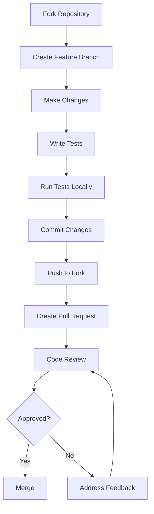

# Community Guidelines & Resources

This directory contains resources and guidelines for community engagement, contribution, and collaboration on the Katya project.

## 🤝 Community Values

### Our Mission
To build a secure, private messaging platform that empowers users with control over their digital communication while fostering an inclusive and supportive community.

### Core Values
- **🔒 Privacy First**: User privacy and data protection are paramount
- **🌍 Inclusivity**: Welcome contributors from all backgrounds and skill levels
- **🤝 Collaboration**: Work together to build something amazing
- **📚 Transparency**: Open communication and decision-making processes
- **🚀 Innovation**: Embrace new ideas and technologies
- **💪 Sustainability**: Build for the long-term with maintainable code

## 📋 Contribution Guidelines

### Getting Started

#### 1. Choose Your Path
- **🐛 Bug Reports**: Help us identify and fix issues
- **✨ Feature Requests**: Suggest new functionality
- **📖 Documentation**: Improve guides and tutorials
- **🔧 Code Contributions**: Submit pull requests
- **🎨 Design**: UI/UX improvements and assets
- **🌐 Translations**: Help localize the application
- **🧪 Testing**: Write and run tests
- **📣 Community Support**: Help other users

#### 2. Find Your First Task
```bash
# Look for good first issues
gh issue list --label "good first issue" --state open

# Check the contribution board
# Visit: https://github.com/orgs/katya-project/projects/1
```

#### 3. Set Up Your Environment
```bash
# Clone the repository
git clone https://github.com/katya-project/katya.git
cd katya

# Install dependencies
flutter pub get

# Run the application
flutter run
```

### Code Contribution Process

#### Development Workflow


#### Branch Naming Convention
```
feature/add-dark-mode
bugfix/fix-crash-on-login
docs/update-contribution-guide
refactor/cleanup-auth-module
test/add-unit-tests-auth
```

#### Commit Message Format
```
type(scope): description

[optional body]

[optional footer]
```

**Types:**
- `feat`: New feature
- `fix`: Bug fix
- `docs`: Documentation
- `style`: Code style changes
- `refactor`: Code refactoring
- `test`: Testing
- `chore`: Maintenance

**Examples:**
```
feat(auth): add biometric authentication
fix(ui): resolve crash on settings screen
docs(readme): update installation instructions
```

### Pull Request Guidelines

#### PR Checklist
- [ ] **Title**: Clear, descriptive title following convention
- [ ] **Description**: Detailed explanation of changes
- [ ] **Tests**: New tests added or existing tests pass
- [ ] **Documentation**: Updated if needed
- [ ] **Screenshots**: For UI changes
- [ ] **Breaking Changes**: Marked if applicable
- [ ] **Related Issues**: Linked to relevant issues

#### PR Template Usage
```markdown
## 📝 Description
Brief description of the changes

## 🎯 Type of Change
- [ ] Bug fix
- [ ] New feature
- [ ] Breaking change
- [ ] Documentation update

## 🧪 Testing
- [ ] Unit tests pass
- [ ] Integration tests pass
- [ ] Manual testing completed

## 📋 Checklist
- [ ] Code follows style guidelines
- [ ] Self-review completed
- [ ] Documentation updated
- [ ] Tests added/updated
```

## 🎯 Community Programs

### Mentorship Program

#### For Mentees
- **Eligibility**: New contributors interested in learning
- **Duration**: 3-6 months
- **Benefits**:
  - One-on-one guidance from experienced developers
  - Structured learning path
  - Real project contributions
  - Certificate of completion

#### For Mentors
- **Eligibility**: Experienced contributors with 6+ months involvement
- **Commitment**: 5-10 hours per month
- **Benefits**:
  - Leadership experience
  - Recognition in the community
  - Networking opportunities
  - Skill development in teaching

#### How to Apply
1. **Mentees**: Fill out the [mentorship application form](https://forms.katya.rechain.network/mentee)
2. **Mentors**: Contact the mentorship coordinator at mentorship@katya.rechain.network

### Ambassador Program

#### Program Benefits
- **Recognition**: Featured on the website and social media
- **Swag**: Exclusive Katya merchandise
- **Early Access**: Beta features and releases
- **Events**: Invitations to community events
- **Networking**: Connect with other ambassadors

#### Responsibilities
- **Content Creation**: Blog posts, tutorials, videos
- **Community Support**: Help users in forums and Discord
- **Event Participation**: Speak at meetups and conferences
- **Feedback Collection**: Gather user feedback and suggestions

#### Application Process
1. **Demonstrate Engagement**: Active community participation for 3+ months
2. **Submit Application**: [Ambassador application form](https://forms.katya.rechain.network/ambassador)
3. **Interview**: Meet with the community team
4. **Onboarding**: Complete ambassador training

## 📚 Learning Resources

### Documentation
- **[Getting Started Guide](../Getting_Started.md)**: Complete setup instructions
- **[Contributing Guide](../Contributing.md)**: Detailed contribution guidelines
- **[API Documentation](../docs/api/README.md)**: Technical API references
- **[Architecture Overview](../docs/architecture/README.md)**: System design and patterns

### Learning Paths

#### Beginner Path
1. **Setup Environment**: Install Flutter and required tools
2. **Run the App**: Get familiar with the codebase
3. **Fix a Bug**: Start with "good first issue" labels
4. **Write Tests**: Learn testing practices
5. **Submit PR**: Your first contribution

#### Intermediate Path
1. **Feature Development**: Implement new features
2. **Code Review**: Review other contributors' code
3. **Documentation**: Write technical documentation
4. **Testing**: Advanced testing techniques
5. **Architecture**: Understand system design

#### Advanced Path
1. **System Design**: Design new subsystems
2. **Performance**: Optimize application performance
3. **Security**: Implement security features
4. **Scalability**: Design for scale
5. **Leadership**: Mentor other contributors

### Code Examples

#### Flutter Widget Example
```dart
class CustomMessageBubble extends StatelessWidget {
  final Message message;
  final bool isOwnMessage;

  const CustomMessageBubble({
    Key? key,
    required this.message,
    required this.isOwnMessage,
  }) : super(key: key);

  @override
  Widget build(BuildContext context) {
    return Container(
      margin: const EdgeInsets.symmetric(vertical: 4, horizontal: 8),
      alignment: isOwnMessage ? Alignment.centerRight : Alignment.centerLeft,
      child: Container(
        padding: const EdgeInsets.all(12),
        decoration: BoxDecoration(
          color: isOwnMessage ? Colors.blue : Colors.grey[300],
          borderRadius: BorderRadius.circular(16),
        ),
        child: Text(
          message.content,
          style: TextStyle(
            color: isOwnMessage ? Colors.white : Colors.black,
          ),
        ),
      ),
    );
  }
}
```

#### Testing Example
```dart
void main() {
  group('MessageBubble Tests', () {
    test('displays message content correctly', () {
      final message = Message(content: 'Hello World', sender: 'user1');
      final widget = CustomMessageBubble(
        message: message,
        isOwnMessage: false,
      );

      // Test rendering
      expect(find.text('Hello World'), findsOneWidget);
    });

    test('applies correct styling for own messages', () {
      final message = Message(content: 'My message', sender: 'user1');
      final widget = CustomMessageBubble(
        message: message,
        isOwnMessage: true,
      );

      // Test styling
      final container = find.byType(Container).first;
      final decoration = tester.widget<Container>(container).decoration as BoxDecoration;
      expect(decoration.color, Colors.blue);
    });
  });
}
```

## 💬 Communication Channels

### Official Channels
- **GitHub Discussions**: Technical discussions and Q&A
- **Discord Server**: Real-time chat and community events
- **Forum**: Long-form discussions and announcements
- **Newsletter**: Monthly updates and news

### Community Guidelines

#### Discord Guidelines
- **Be Respectful**: Treat everyone with kindness and respect
- **Stay On Topic**: Use appropriate channels for discussions
- **No Spam**: Avoid excessive self-promotion
- **Help Others**: Share knowledge and help fellow community members
- **Follow Rules**: Adhere to the community code of conduct

#### GitHub Discussions
- **Search First**: Check if your question has been asked before
- **Clear Titles**: Use descriptive titles for your posts
- **Provide Context**: Include relevant details and context
- **Use Categories**: Choose the appropriate category for your post
- **Be Patient**: Allow time for community members to respond

## 🎉 Events & Meetups

### Regular Events
- **Community Calls**: Monthly video calls for updates and Q&A
- **Hackathons**: Quarterly coding events
- **Workshops**: Skill-building sessions
- **AMAs**: Ask Me Anything sessions with maintainers

### Event Calendar
```javascript
const communityEvents = [
  {
    name: "Monthly Community Call",
    date: "2024-02-15",
    time: "18:00 UTC",
    platform: "Discord",
    description: "Monthly update and Q&A session"
  },
  {
    name: "Flutter Workshop",
    date: "2024-02-22",
    time: "14:00 UTC",
    platform: "YouTube Live",
    description: "Learn Flutter development with Katya"
  },
  {
    name: "Security Audit Review",
    date: "2024-03-01",
    time: "16:00 UTC",
    platform: "GitHub Discussions",
    description: "Review latest security audit results"
  }
];
```

### Organizing Events
1. **Propose Event**: Create an issue with event details
2. **Get Approval**: Community team reviews and approves
3. **Plan Logistics**: Arrange platform, timing, and promotion
4. **Promote Event**: Share on all community channels
5. **Host Event**: Run the event and engage participants
6. **Follow Up**: Share recordings and summaries

## 🏆 Recognition & Rewards

### Contribution Recognition
- **Contributor Badges**: Earn badges for different types of contributions
- **Hall of Fame**: Featured contributors on the website
- **Shoutouts**: Recognition in newsletters and social media
- **Certificates**: Digital certificates for significant contributions

### Reward Tiers
```javascript
const rewardTiers = {
  bronze: {
    contributions: 5,
    badge: "🥉 First Steps",
    perks: ["Community forum access", "Monthly newsletter"]
  },
  silver: {
    contributions: 25,
    badge: "🥈 Community Helper",
    perks: ["Early access to features", "Exclusive Discord channels"]
  },
  gold: {
    contributions: 100,
    badge: "🥇 Community Champion",
    perks: ["Direct maintainer access", "Feature voting priority", "Exclusive swag"]
  },
  platinum: {
    contributions: 500,
    badge: "💎 Community Legend",
    perks: ["All gold perks", "Speaking opportunities", "Board membership consideration"]
  }
};
```

### Achievement System
- **🐛 Bug Hunter**: First bug report or fix
- **✨ Feature Creator**: Implemented new feature
- **📚 Documentation Guru**: Major documentation contributions
- **🧪 Testing Champion**: Comprehensive test coverage
- **🌐 Localization Hero**: Translation contributions
- **🎨 Design Master**: UI/UX improvements
- **🚀 Performance Wizard**: Performance optimizations

## 📊 Community Metrics

### Engagement Metrics
- **Active Contributors**: Monthly active contributors
- **Response Time**: Average time to first response on issues
- **Resolution Rate**: Percentage of issues resolved
- **Community Growth**: New member acquisition rate

### Quality Metrics
- **Code Review Coverage**: Percentage of PRs reviewed
- **Test Coverage**: Overall test coverage percentage
- **Documentation Completeness**: Documentation coverage score
- **User Satisfaction**: Community satisfaction survey results

### Diversity Metrics
- **Geographic Diversity**: Contributors by region
- **Skill Diversity**: Types of contributions and skills
- **Experience Diversity**: Range of contributor experience levels
- **Background Diversity**: Professional and personal backgrounds

## 🤗 Code of Conduct

### Expected Behavior
- **Be Respectful**: Treat all community members with respect
- **Be Inclusive**: Welcome people from all backgrounds
- **Be Collaborative**: Work together towards common goals
- **Be Patient**: Allow time for responses and learning
- **Be Constructive**: Provide helpful feedback and suggestions

### Unacceptable Behavior
- **Harassment**: Any form of harassment or discrimination
- **Spam**: Excessive self-promotion or irrelevant content
- **Trolling**: Deliberately disruptive or antagonistic behavior
- **Privacy Violations**: Sharing others' personal information
- **Impersonation**: Pretending to be someone else

### Reporting Violations
- **Contact**: code-of-conduct@katya.rechain.network
- **Anonymous Reporting**: Available through the website
- **Response Time**: Within 24 hours for urgent issues
- **Confidentiality**: Reports handled with strict confidentiality

## 🌟 Success Stories

### Community Impact Stories
- **From User to Contributor**: How community members became maintainers
- **Feature from Idea to Reality**: Community-driven feature development
- **Global Collaboration**: Cross-cultural team collaboration stories
- **Learning Journeys**: Personal growth stories from contributors

### Featured Contributors
```json
{
  "featuredContributors": [
    {
      "name": "Alex Chen",
      "contribution": "Flutter Development",
      "impact": "Led mobile app performance optimization",
      "story": "Started as a bug reporter, now leads mobile development"
    },
    {
      "name": "Maria Rodriguez",
      "contribution": "Localization",
      "impact": "Added Spanish and Portuguese support",
      "story": "Brought Katya to Spanish-speaking markets"
    },
    {
      "name": "David Kim",
      "contribution": "Security",
      "impact": "Implemented end-to-end encryption",
      "story": "Enhanced privacy features for all users"
    }
  ]
}
```

## 📞 Support Resources

### Getting Help
- **Documentation**: Comprehensive guides and tutorials
- **Community Forum**: Peer-to-peer support
- **Discord Support**: Real-time help from community
- **GitHub Issues**: Bug reports and feature requests
- **Office Hours**: Regular maintainer availability

### Support Channels
```javascript
const supportChannels = {
  beginner: {
    channel: "#help-beginners",
    responseTime: "< 1 hour",
    topics: ["Setup", "Getting started", "Basic questions"]
  },
  technical: {
    channel: "#help-technical",
    responseTime: "< 4 hours",
    topics: ["Code issues", "Build problems", "API questions"]
  },
  urgent: {
    channel: "#urgent-help",
    responseTime: "< 30 minutes",
    topics: ["Security issues", "Data loss", "Service outages"]
  }
};
```

## 🎯 Future Initiatives

### Planned Programs
- **Educational Content**: Video tutorials and courses
- **Certification Program**: Contributor certification tracks
- **Conference Scholarships**: Funding for community members to attend events
- **Research Partnerships**: Academic collaborations
- **Diversity Initiatives**: Programs to increase community diversity

### Community Roadmap
- **Q1 2024**: Launch mentorship program
- **Q2 2024**: Implement achievement system
- **Q3 2024**: Expand localization efforts
- **Q4 2024**: Host first community conference

## 📬 Contact Information

- **Community Manager**: community@katya.rechain.network
- **Technical Support**: support@katya.rechain.network
- **Code of Conduct**: conduct@katya.rechain.network
- **Events Coordinator**: events@katya.rechain.network

## 🔗 Related Resources

- [Contributing Guidelines](../Contributing.md)
- [Code of Conduct](../CODE_OF_CONDUCT.md)
- [Development Roadmap](../ROADMAP.md)
- [Project Governance](../GOVERNANCE.md)

---

*Building a strong, inclusive community is essential to Katya's success. Together, we can create something amazing!*
