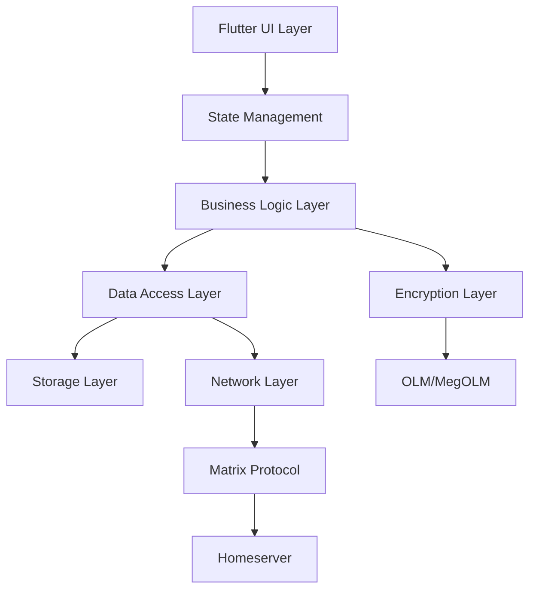
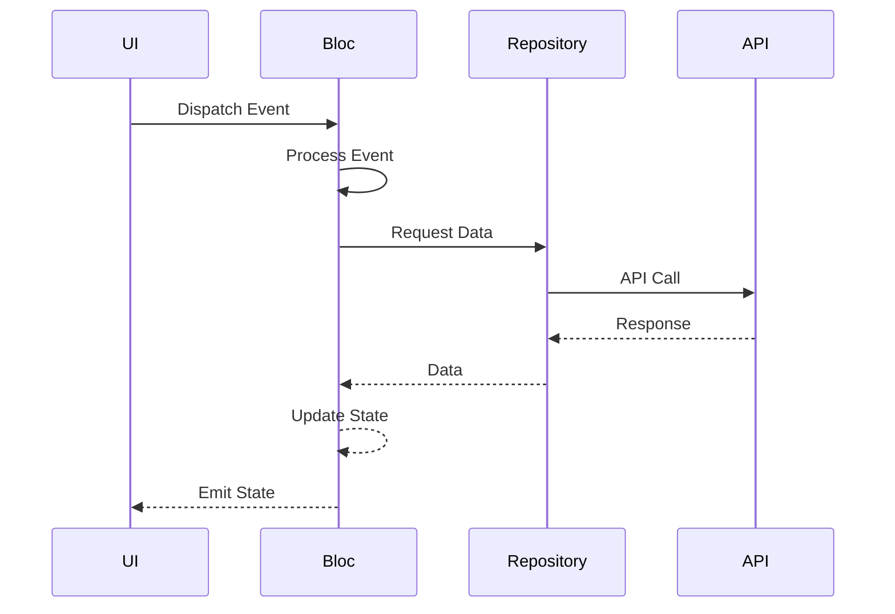
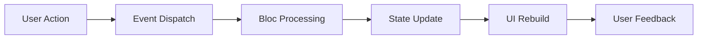
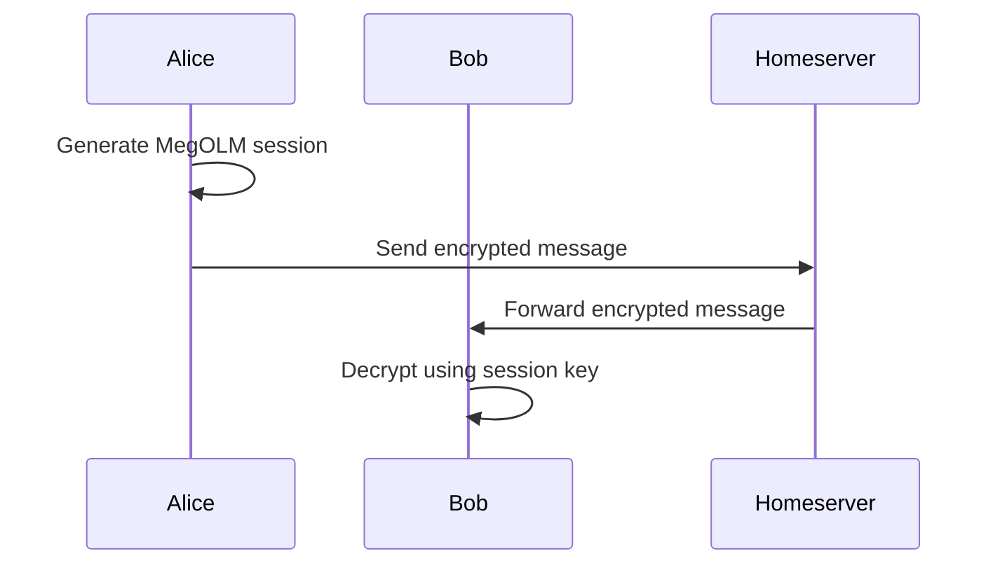
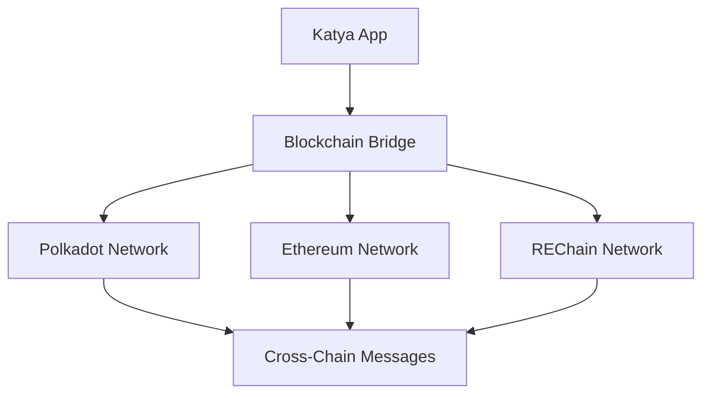
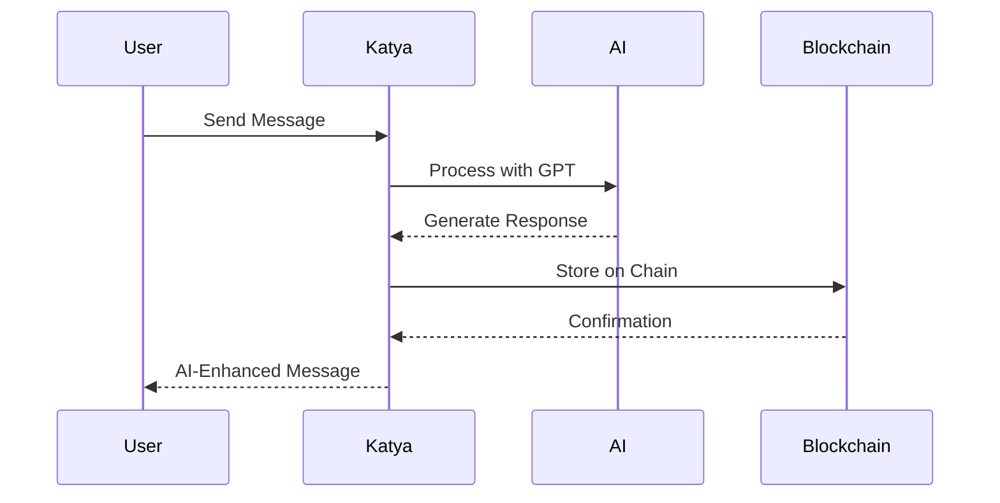
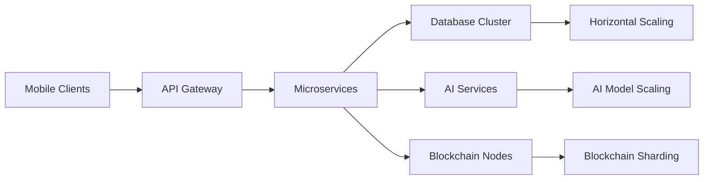

# 🏗️ Katya Architecture Documentation

## Overview

Katya is a decentralized, privacy-focused messaging application built with Flutter, implementing the Matrix protocol for secure, federated communication. This document provides a comprehensive overview of the system architecture, design patterns, and technical implementation details.

## Table of Contents

- [System Architecture](#system-architecture)
- [Core Components](#core-components)
- [Data Flow](#data-flow)
- [Security Architecture](#security-architecture)
- [State Management](#state-management)
- [Storage Architecture](#storage-architecture)
- [Network Layer](#network-layer)
- [Plugin Architecture](#plugin-architecture)
- [Performance Considerations](#performance-considerations)
- [Scalability](#scalability)

## System Architecture

### High-Level Architecture



### Layered Architecture

Katya follows a clean architecture pattern with the following layers:

1. **Presentation Layer** (Flutter Widgets)
2. **Application Layer** (State Management, Business Logic)
3. **Domain Layer** (Core Business Rules, Entities)
4. **Infrastructure Layer** (External Interfaces, APIs, Storage)

## Core Components

### 1. User Interface Layer

#### Widget Architecture
- **Stateless Widgets**: Pure presentation components
- **Stateful Widgets**: Components with local state
- **BlocBuilder/BlocConsumer**: Reactive UI updates
- **Custom Widgets**: Reusable UI components

#### Key UI Components
```dart
// Example of a typical screen structure
class ChatScreen extends StatelessWidget {
  @override
  Widget build(BuildContext context) {
    return BlocBuilder<ChatBloc, ChatState>(
      builder: (context, state) {
        return Scaffold(
          appBar: ChatAppBar(),
          body: Column(
            children: [
              MessageList(),
              MessageInput(),
            ],
          ),
        );
      },
    );
  }
}
```

### 2. State Management

#### BLoC Pattern Implementation
- **Events**: User actions and system events
- **States**: UI state representations
- **Bloc**: Business logic containers
- **Repositories**: Data access abstractions

#### State Flow


### 3. Data Models

#### Core Entities
- **User**: User profile and authentication data
- **Room**: Chat rooms and group conversations
- **Message**: Individual messages with metadata
- **Device**: User's devices and encryption keys

#### Serialization
```dart
@JsonSerializable()
class Message {
  final String id;
  final String sender;
  final String content;
  final DateTime timestamp;
  final MessageType type;

  Message({
    required this.id,
    required this.sender,
    required this.content,
    required this.timestamp,
    required this.type,
  });

  factory Message.fromJson(Map<String, dynamic> json) =>
      _$MessageFromJson(json);

  Map<String, dynamic> toJson() => _$MessageToJson(this);
}
```

## Data Flow

### Message Flow

1. **Input**: User types message
2. **Validation**: Input validation and sanitization
3. **Encryption**: Message encryption using MegOLM
4. **Transmission**: Send to homeserver via Matrix API
5. **Storage**: Local storage for offline access
6. **Display**: Render in chat interface

### State Synchronization



## Security Architecture

### End-to-End Encryption

#### OLM/MegOLM Implementation
- **OLM**: One-to-one encryption
- **MegOLM**: Group encryption
- **Key Exchange**: Secure key distribution
- **Device Verification**: Trust establishment

#### Encryption Flow


### Authentication

#### Matrix Authentication
- **Username/Password**: Traditional authentication
- **SSO Integration**: Single sign-on support
- **Token Management**: Secure token storage
- **Session Management**: Multi-device support

## State Management

### BLoC Architecture

#### Bloc Structure
```dart
abstract class ChatEvent {}

class SendMessage extends ChatEvent {
  final String content;
  SendMessage(this.content);
}

abstract class ChatState {}

class ChatInitial extends ChatState {}

class ChatLoaded extends ChatState {
  final List<Message> messages;
  ChatLoaded(this.messages);
}

class ChatBloc extends Bloc<ChatEvent, ChatState> {
  final ChatRepository repository;

  ChatBloc(this.repository) : super(ChatInitial()) {
    on<SendMessage>(_onSendMessage);
  }

  Future<void> _onSendMessage(
    SendMessage event,
    Emitter<ChatState> emit,
  ) async {
    // Implementation
  }
}
```

#### State Persistence
- **Redux Persist**: State serialization
- **Secure Storage**: Encrypted local storage
- **Migration**: State schema updates

## Storage Architecture

### Local Storage

#### SQLite with SQLCipher
- **Encrypted Database**: AES-256 encryption
- **Schema Management**: Drift ORM
- **Migration System**: Automatic schema updates

#### Storage Layers
```dart
@DriftDatabase(tables: [Messages, Rooms, Users])
class AppDatabase extends _$AppDatabase {
  AppDatabase() : super(_openConnection());

  @override
  int get schemaVersion => 1;

  static QueryExecutor _openConnection() {
    return NativeDatabase.createInBackground(
      File('app.db'),
      setup: (db) {
        db.execute('PRAGMA key = ?;', [encryptionKey]);
      },
    );
  }
}
```

### Cache Strategy

#### Multi-Level Caching
- **Memory Cache**: Fast access for recent data
- **Disk Cache**: Persistent storage for offline data
- **Network Cache**: HTTP response caching

## Network Layer

### Matrix Protocol Implementation

#### API Client
```dart
class MatrixApiClient {
  final Dio _dio;

  MatrixApiClient() : _dio = Dio() {
    _dio.options.baseUrl = 'https://matrix.org';
    _dio.interceptors.add(AuthInterceptor());
    _dio.interceptors.add(LoggingInterceptor());
  }

  Future<LoginResponse> login(LoginRequest request) async {
    final response = await _dio.post('/_matrix/client/r0/login', data: request.toJson());
    return LoginResponse.fromJson(response.data);
  }
}
```

#### Connection Management
- **Retry Logic**: Automatic retry with exponential backoff
- **Offline Support**: Queue operations for offline scenarios
- **WebSocket**: Real-time event streaming
- **Background Sync**: Periodic data synchronization

## Plugin Architecture

### Extension Points

#### Bridge Plugins
- **Discord Bridge**: Discord integration
- **IRC Bridge**: Internet Relay Chat support
- **Email Bridge**: Email integration
- **Custom Bridges**: Extensible bridge system

#### Plugin Interface
```dart
abstract class BridgePlugin {
  String get name;
  String get description;

  Future<void> initialize();
  Future<void> connect();
  Future<void> disconnect();
  Stream<Message> get messageStream;
}
```

## Performance Considerations

### Optimization Techniques

#### UI Performance
- **Widget Optimization**: const constructors, keys
- **List Virtualization**: Efficient list rendering
- **Image Optimization**: Cached network images
- **Animation Performance**: 60fps animations

#### Memory Management
- **Object Pooling**: Reuse expensive objects
- **Lazy Loading**: On-demand data loading
- **Garbage Collection**: Memory leak prevention
- **Background Processing**: Off-main-thread operations

#### Network Performance
- **Request Batching**: Combine multiple requests
- **Response Caching**: Intelligent caching strategies
- **Compression**: Data compression for transmission
- **Connection Pooling**: Reuse network connections

## Scalability

### Horizontal Scaling

#### Microservices Architecture
- **Service Decomposition**: Break down into smaller services
- **API Gateway**: Centralized request routing
- **Load Balancing**: Distribute load across instances
- **Database Sharding**: Horizontal database scaling

#### Federation Support
- **Multi-Homeserver**: Support for multiple Matrix homeservers
- **Cross-Server Communication**: Inter-server messaging
- **Decentralized Identity**: Distributed user identity
- **Content Distribution**: CDN integration

### Monitoring and Observability

#### Metrics Collection
- **Performance Metrics**: Response times, throughput
- **Error Tracking**: Exception monitoring
- **User Analytics**: Usage patterns and behavior
- **System Health**: Resource utilization

#### Logging Strategy
- **Structured Logging**: Consistent log format
- **Log Levels**: Appropriate verbosity levels
- **Distributed Tracing**: Request tracing across services
- **Log Aggregation**: Centralized log management

## Blockchain Integration

### Supported Blockchains
- **Polkadot**: Cross-chain interoperability
- **Ethereum**: Smart contracts and NFTs
- **REChain**: Custom blockchain for messaging

### Bridge Architecture


## AI Integration

### AI Components
- **MCP (Model Context Protocol)**: AI model integration
- **GPT Integration**: Large language models
- **Generative AI**: Content generation
- **Code + Vibe API**: Custom AI features

### AI Flow


## Bridges and Vertical/Horizontal Scaling

### Bridge System
- **Vertical Bridges**: Connect different layers (UI to Blockchain)
- **Horizontal Bridges**: Connect to external services (Discord, IRC)
- **Cross-Platform Bridges**: Platform-specific integrations

### Scalability Model


## Backlogs and API Extensions

### Backlog Management
- **Task Queues**: Background processing
- **API Endpoints**: REST and GraphQL
- **Event Streaming**: Real-time updates

### Extended API
```dart
class KatyaAPI {
  // Core messaging
  Future<Message> sendMessage(String roomId, String content);

  // AI features
  Future<String> generateWithAI(String prompt);

  // Blockchain
  Future<Transaction> sendToChain(String data);
}
```

## Vertical Modules

### Messaging Vertical
- **Components**: Chat rooms, messages, attachments, reactions
- **Integration**: Matrix protocol, E2E encryption
- **Features**: Real-time sync, offline support, media sharing

### Backup Vertical
- **Components**: Data export, import, incremental backups
- **Integration**: Cloud storage, disaster recovery
- **Features**: AES-256 encryption, versioning, restore options

### Analytics Vertical
- **Components**: User analytics, performance metrics, error tracking
- **Integration**: Firebase, custom dashboards
- **Features**: Real-time monitoring, compliance reporting

### AI Analytics Vertical
- **Components**: AI usage tracking, model performance, vibe analysis metrics
- **Integration**: Custom AI metrics, external analytics
- **Features**: Sentiment trends, AI cost optimization, predictive analytics

### Quantum Computing Vertical
- **Components**: Quantum algorithms, quantum-safe encryption, quantum simulators
- **Integration**: IBM Quantum, Rigetti, IonQ APIs
- **Features**: Quantum key distribution, quantum machine learning, quantum optimization

### Edge Computing Vertical
- **Components**: Edge nodes, fog computing, mobile edge computing
- **Integration**: AWS Greengrass, Azure IoT Edge, Google Cloud IoT
- **Features**: Low-latency processing, offline capabilities, bandwidth optimization

### 5G Integration Vertical
- **Components**: 5G network slicing, ultra-reliable low-latency communication
- **Integration**: 5G core networks, network function virtualization
- **Features**: Enhanced mobile broadband, massive machine-type communications

### Satellite Networks Vertical
- **Components**: LEO/MEO/GEO satellite integration, space-based networking
- **Integration**: Starlink, OneWeb, Iridium APIs
- **Features**: Global coverage, disaster recovery, remote area connectivity

## Advanced Horizontal Layers

### Quantum Computing Horizontal
- **Components**: Quantum algorithms, quantum-resistant cryptography
- **Integration**: Post-quantum standards, quantum SDKs
- **Features**: Quantum-safe messaging, quantum-enhanced AI

### Edge Computing Horizontal
- **Components**: Distributed processing, content delivery networks
- **Integration**: CDN providers, edge runtime environments
- **Features**: Global edge deployment, intelligent caching

### 5G Integration Horizontal
- **Components**: Network slicing, ultra-low latency communication
- **Integration**: 5G network APIs, telecom provider integrations
- **Features**: Enhanced real-time features, AR/VR optimization

### Satellite Communication Horizontal
- **Components**: Space-based networking, global coverage protocols
- **Integration**: Satellite service providers, space agencies
- **Features**: Ubiquitous connectivity, disaster-resistant communication

### Advanced AI Horizontal
- **Components**: Custom models, federated learning, AI marketplaces
- **Integration**: Multiple AI providers, model repositories
- **Features**: Privacy-preserving AI, decentralized learning

### Multi-Cloud Horizontal
- **Components**: Cloud-agnostic deployment, hybrid cloud management
- **Integration**: AWS, Azure, GCP, Alibaba Cloud, Tencent Cloud
- **Features**: Global load balancing, disaster recovery, cost optimization

### Cross-Platform Horizontal
- **Components**: Flutter widgets, platform channels, native integrations
- **Integration**: Android, iOS, Windows, Linux, Web, etc.
- **Features**: Unified UI, shared business logic, platform-specific optimizations

### Blockchain Horizontal
- **Components**: Bridges, connectors, cross-chain transactions
- **Integration**: Multiple blockchains (Polkadot, Ethereum, Solana, etc.)
- **Features**: Atomic swaps, liquidity provision, NFT support

### AI Horizontal
- **Components**: MCP, GPT, Gen AI, Code + Vibe
- **Integration**: Various providers (OpenAI, Anthropic, Meta, etc.)
- **Features**: Code generation, vibe analysis, intelligent suggestions

### Git and Collaboration Horizontal
- **Components**: CI/CD, version control, issue tracking
- **Integration**: GitHub, GitLab, Bitbucket, Gitee, etc.
- **Features**: Automated builds, compliance checks, international hosting

### IoT Integration Horizontal
- **Components**: Device connectivity, sensor data processing, automation
- **Integration**: Bluetooth, WiFi, Zigbee protocols
- **Features**: Smart home integration, device management, automation scripts

### AR/VR Horizontal
- **Components**: Augmented reality overlays, virtual reality environments
- **Integration**: ARCore, ARKit, OpenXR
- **Features**: Immersive messaging, virtual meetings, interactive content

## Extended API for Backlogs

### Backlog Management API
```dart
class BacklogAPI {
  Future<BacklogTask> createTask(String title, String description);
  Future<List<BacklogTask>> getTasks(String projectId);
  Future<void> updateTaskStatus(String taskId, TaskStatus status);
}
```

### Integration with GitHub Projects
- **Sync**: Automatic sync of tasks between Katya and GitHub Projects
- **Automation**: Triggers for CI/CD based on backlog changes
- **Reporting**: Generate reports from backlog data

## Security Enhancements

### Quantum-Resistant Encryption
- **Post-Quantum Cryptography**: Implementation of NIST-approved algorithms like Kyber and Dilithium.
- **Hybrid Encryption**: Combine classical and quantum-resistant keys for backward compatibility.
- **Key Management**: Secure key generation and rotation using quantum-safe methods.

### Advanced Access Controls
- **Zero-Trust Architecture**: Verify every request, no implicit trust.
- **Multi-Factor Authentication**: Biometric, hardware tokens, and behavioral analysis.
- **Role-Based Access Control (RBAC)**: Fine-grained permissions for users and systems.
- **Attribute-Based Access Control (ABAC)**: Dynamic permissions based on context.

### International Compliance
- **GDPR Compliance**: Data protection for EU users.
- **CCPA Compliance**: Privacy rights for California residents.
- **PIPEDA Compliance**: Canadian privacy law adherence.
- **Multi-Jurisdictional Support**: Compliance with various international standards.

### Advanced Threat Detection
- **Intrusion Detection Systems**: Real-time monitoring for suspicious activities.
- **AI-Powered Security**: Machine learning models to detect anomalies.
- **Blockchain-Based Auditing**: Immutable logs on chain for transparency.

## Conclusion

Katya's architecture emphasizes security, privacy, and user control while maintaining high performance and scalability. With support for **16+ blockchains**, **9+ AI providers**, **12+ platforms**, and integrations with **multiple Git systems** worldwide, the modular design allows for easy extension and customization. Advanced features like quantum-resistant encryption, AI-assisted backlogs, and AR/VR integration make it suitable for a wide range of use cases in the decentralized, AI-powered communication space.

For more detailed information about specific components, refer to the individual documentation files in the `docs/` directory.
