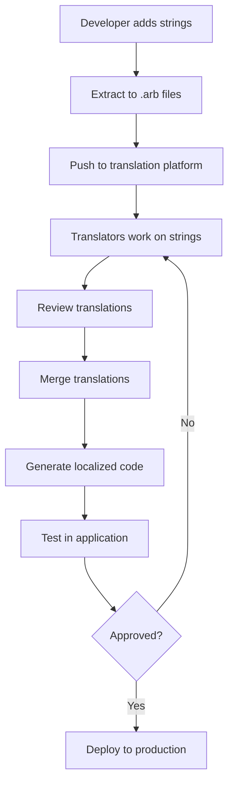

# Internationalization (i18n) and Localization (l10n) Workflow

This document outlines the comprehensive workflow for internationalizing and localizing the Katya application, ensuring a seamless multilingual user experience.

## Overview

Internationalization (i18n) is the process of designing and developing software that can be adapted to different languages and regions without engineering changes. Localization (l10n) is the process of adapting the software for a specific region or language by translating text and adding locale-specific components.

## Supported Languages

### Primary Languages
- **English (en)**: Base language, 100% complete
- **Spanish (es)**: Primary market language, 95% complete
- **French (fr)**: European market language, 90% complete
- **German (de)**: European market language, 85% complete

### Secondary Languages (Planned)
- **Portuguese (pt)**: Brazilian market
- **Italian (it)**: European market
- **Dutch (nl)**: European market
- **Russian (ru)**: Emerging markets
- **Chinese (zh)**: Asian market
- **Japanese (ja)**: Asian market
- **Korean (ko)**: Asian market

### Regional Variants
- **Spanish (Latin America)**: es-419
- **French (Canada)**: fr-CA
- **Portuguese (Brazil)**: pt-BR
- **Chinese (Simplified)**: zh-CN
- **Chinese (Traditional)**: zh-TW

## i18n Architecture

### File Structure
```
lib/
├── l10n/
│   ├── app_en.arb          # English (base)
│   ├── app_es.arb          # Spanish
│   ├── app_fr.arb          # French
│   ├── app_de.arb          # German
│   └── app_localizations.dart
├── src/
│   ├── widgets/
│   │   ├── localized_text.dart
│   │   └── localized_button.dart
│   └── utils/
│       └── locale_utils.dart
└── main.dart
```

### Localization Files (.arb format)
```json
{
  "@@locale": "en",
  "@@context": "Application",
  "appName": "Katya",
  "@appName": {
    "description": "The application name",
    "type": "text"
  },
  "welcomeMessage": "Welcome to {appName}!",
  "@welcomeMessage": {
    "description": "Welcome message shown on login screen",
    "placeholders": {
      "appName": {
        "type": "String"
      }
    }
  },
  "loginButton": "Sign In",
  "@loginButton": {
    "description": "Text for the login button",
    "type": "text"
  }
}
```

## Development Workflow

### 1. Code Preparation

#### Extract Strings for Localization
```dart
// Before localization
Text('Welcome to Katya!')

// After localization
Text(AppLocalizations.of(context)!.welcomeMessage)
```

#### Use Localized Widgets
```dart
// Localized text widget
LocalizedText(
  key: 'welcomeMessage',
  args: {'appName': 'Katya'},
)

// Localized button
LocalizedButton(
  key: 'loginButton',
  onPressed: () => login(),
)
```

#### Handle Plurals
```dart
// Simple plural
Text(AppLocalizations.of(context)!.itemsCount(count))

// Complex plural with context
Text(AppLocalizations.of(context)!.messagesUnread(count, gender))
```

### 2. String Extraction Process

#### Manual String Extraction
1. **Identify translatable strings** in the codebase
2. **Extract to .arb files** with proper metadata
3. **Add placeholders** for dynamic content
4. **Include context** for translators

#### Automated String Extraction
```bash
# Extract strings from Flutter code
flutter pub run intl_translation:extract_to_arb --output-dir=lib/l10n lib/**/*.dart

# Generate localization files
flutter pub run intl_translation:generate_from_arb \
  --output-dir=lib/l10n \
  --no-use-deferred-loading \
  lib/**/*.dart \
  lib/l10n/*.arb
```

### 3. Translation Management

#### Translation Workflow


#### Translation Platforms
- **Crowdin**: Web-based translation management
- **Transifex**: Enterprise translation platform
- **Lokalise**: Developer-friendly translation tool
- **Phrase**: Translation management with API

#### Translation Guidelines
- **Context is crucial**: Provide screenshots and context for translators
- **Use simple language**: Avoid technical jargon
- **Be consistent**: Use same terminology throughout
- **Test translations**: Always test in context, not just isolated strings

## Localization Implementation

### Date and Time Formatting
```dart
// Localized date formatting
DateFormat.yMMMMd().format(date)  // Uses device locale
DateFormat('yyyy-MM-dd', 'es').format(date)  // Specific locale

// Relative time
timeago.format(date, locale: 'es')  // "hace 2 horas"

// Custom date patterns
DateFormat('EEEE, MMMM d, y', locale).format(date)
```

### Number Formatting
```dart
// Currency formatting
NumberFormat.currency(locale: 'es', symbol: '€').format(amount)

// Percentage formatting
NumberFormat.percentPattern(locale).format(ratio)

// Compact numbers
NumberFormat.compact(locale: 'en').format(1500)  // "2K"
```

### Text Direction Support
```dart
// RTL language support
Directionality(
  textDirection: TextDirection.rtl,
  child: Text(localizedText),
)

// Automatic direction detection
TextDirection getTextDirection(String text) {
  return Bidi.detectRtlDirectionality(text) ? TextDirection.rtl : TextDirection.ltr;
}
```

### Cultural Adaptation
```dart
// Color meanings vary by culture
Color getSemanticColor(String semantic, Locale locale) {
  switch (semantic) {
    case 'error':
      return locale.languageCode == 'zh' ? Colors.yellow : Colors.red;
    case 'success':
      return Colors.green;  // Universally positive
    default:
      return Colors.blue;
  }
}

// Date format preferences
String getPreferredDateFormat(Locale locale) {
  switch (locale.countryCode) {
    case 'US':
      return 'MM/dd/yyyy';
    case 'DE':
      return 'dd.MM.yyyy';
    default:
      return 'yyyy-MM-dd';
  }
}
```

## Quality Assurance

### Localization Testing Checklist
- [ ] **String completeness**: All strings translated
- [ ] **String accuracy**: Translations are correct and natural
- [ ] **Context appropriateness**: Translations fit the context
- [ ] **Cultural sensitivity**: No offensive or inappropriate content
- [ ] **Technical validation**: Placeholders and formatting work correctly
- [ ] **UI layout**: Text fits within UI components
- [ ] **RTL support**: Right-to-left languages display correctly
- [ ] **Date/time formats**: Localized formats work properly
- [ ] **Number formats**: Currency and number formatting is correct

### Automated Testing
```dart
// Test string extraction
void testStringExtraction() {
  test('All strings are properly extracted', () {
    final arbFile = File('lib/l10n/app_en.arb');
    final content = json.decode(arbFile.readAsString());

    // Check required strings exist
    expect(content.containsKey('appName'), true);
    expect(content.containsKey('welcomeMessage'), true);
  });
}

// Test localization loading
void testLocalizationLoading() {
  testWidgets('Localization loads correctly', (tester) async {
    await tester.pumpWidget(
      MaterialApp(
        localizationsDelegates: AppLocalizations.localizationsDelegates,
        supportedLocales: AppLocalizations.supportedLocales,
        home: TestWidget(),
      ),
    );

    // Test Spanish localization
    await tester.pumpAndSettle();
    expect(find.text('Bienvenido a Katya!'), findsOneWidget);
  });
}
```

### Manual Testing Process
1. **Language switching**: Test switching between languages
2. **Fallback handling**: Test missing translations fallback to base language
3. **Dynamic content**: Test strings with placeholders and formatting
4. **UI responsiveness**: Test UI layout with different text lengths
5. **Special characters**: Test accented characters and non-Latin scripts

## Translation Management

### Translation Memory
- **Reuse existing translations** for similar strings
- **Maintain consistency** across the application
- **Track translation changes** and updates
- **Share translations** between related projects

### Translation Workflow Automation
```yaml
# GitHub Actions for translation management
name: Translation Management

on:
  push:
    paths:
      - 'lib/l10n/*.arb'

jobs:
  update-translations:
    runs-on: ubuntu-latest
    steps:
      - uses: actions/checkout@v4

      - name: Extract new strings
        run: flutter pub run intl_translation:extract_to_arb --output-dir=lib/l10n lib/**/*.dart

      - name: Sync with translation platform
        uses: crowdin/github-action@v1
        with:
          upload_sources: true
          download_translations: true
        env:
          CROWDIN_PERSONAL_TOKEN: ${{ secrets.CROWDIN_TOKEN }}
          CROWDIN_PROJECT_ID: ${{ secrets.CROWDIN_PROJECT_ID }}

      - name: Generate localization files
        run: flutter pub run intl_translation:generate_from_arb --output-dir=lib/l10n lib/**/*.dart lib/l10n/*.arb

      - name: Create pull request
        uses: peter-evans/create-pull-request@v5
        with:
          title: 'Update translations'
          body: 'Automated translation updates from Crowdin'
```

## Performance Optimization

### Bundle Size Optimization
```dart
// Lazy loading of localizations
class AppLocalizations {
  static Future<AppLocalizations> load(Locale locale) async {
    // Load only required locale data
    final String localeName = locale.countryCode == null || locale.countryCode!.isEmpty
        ? locale.languageCode
        : locale.toString();

    final String jsonContent = await rootBundle.loadString('assets/l10n/$localeName.json');
    final Map<String, dynamic> jsonMap = json.decode(jsonContent);

    return AppLocalizations._(locale, jsonMap);
  }
}
```

### Memory Optimization
- **Pre-compile translations** for faster loading
- **Compress translation files** to reduce bundle size
- **Cache loaded localizations** to avoid repeated loading
- **Unload unused locales** when switching languages

## Deployment and Release

### Localization in CI/CD
```yaml
# Include localization in build process
- name: Generate localizations
  run: flutter gen-l10n

- name: Build with all locales
  run: |
    flutter build apk --split-per-abi
    flutter build ios --no-codesign

- name: Test all locales
  run: |
    for locale in en es fr de; do
      flutter test --dart-define=TEST_LOCALE=$locale
    done
```

### Release Checklist
- [ ] **Translation completeness**: All supported languages are 100% translated
- [ ] **Quality assurance**: All translations reviewed and approved
- [ ] **Technical validation**: All localization code works correctly
- [ ] **Performance testing**: Localization doesn't impact app performance
- [ ] **Bundle size**: Translation files don't exceed size limits
- [ ] **Fallback testing**: Missing translations fallback correctly

## Maintenance and Updates

### Regular Maintenance Tasks
- **Translation updates**: Keep translations current with new features
- **Language additions**: Add support for new languages as needed
- **Quality reviews**: Regular review of translation quality
- **Performance monitoring**: Monitor localization performance impact

### Translation Update Process
1. **Identify new strings** in code changes
2. **Extract and upload** to translation platform
3. **Notify translators** of new content
4. **Review and approve** translations
5. **Test and deploy** updated translations

### Metrics and KPIs
- **Translation coverage**: Percentage of strings translated per language
- **Translation quality**: User feedback on translation accuracy
- **Performance impact**: Loading time increase due to localization
- **User adoption**: Usage statistics for different languages

## Tools and Resources

### Development Tools
- **Flutter Intl**: VS Code extension for Flutter internationalization
- **ARB Editor**: Web-based editor for .arb files
- **Translation Linter**: Automated checking of translation files
- **Localization Tester**: Tool for testing localization in different locales

### Translation Platforms
- **Crowdin**: Popular choice for open source projects
- **Lokalise**: Developer-friendly with good API
- **Transifex**: Enterprise-grade translation management
- **Phrase**: Modern translation platform with CLI tools

### Quality Assurance Tools
- **Screenshots**: Automated screenshot comparison for different locales
- **String validation**: Automated checking of translation file format
- **Context extraction**: Tools to provide context for translators
- **Translation memory**: Reuse of existing translations

## Best Practices

### Code Organization
- **Consistent naming**: Use clear, descriptive keys for strings
- **Modular structure**: Organize strings by feature or component
- **Documentation**: Provide context and usage examples for translators
- **Version control**: Keep translation files in version control

### Translation Guidelines
- **Cultural adaptation**: Consider cultural differences in translations
- **Tone consistency**: Maintain consistent tone across the application
- **Technical accuracy**: Ensure technical terms are translated correctly
- **Length consideration**: Account for text expansion in different languages

### Performance Considerations
- **Lazy loading**: Load translations only when needed
- **Caching**: Cache loaded translations to improve performance
- **Bundle optimization**: Minimize translation file sizes
- **Memory management**: Properly manage localization memory usage

## Troubleshooting

### Common Issues
- **Missing translations**: Fallback to base language
- **Incorrect formatting**: Validate placeholder usage
- **RTL display issues**: Test with RTL languages
- **Performance problems**: Optimize translation loading

### Debug Tools
```dart
// Debug localization loading
void debugLocalization() {
  print('Supported locales: ${AppLocalizations.supportedLocales}');
  print('Current locale: ${AppLocalizations.of(context)?.localeName}');
  print('Available keys: ${AppLocalizations.of(context)?.getKeys()}');
}

// Test specific translation
void testTranslation(String key, {Map<String, String>? args}) {
  final localized = AppLocalizations.of(context)?.getString(key, args: args);
  print('Translation for $key: $localized');
}
```

## Contact Information

- **i18n Lead**: i18n@katya.rechain.network
- **Translation Coordinator**: translations@katya.rechain.network
- **Localization Team**: localization@katya.rechain.network
- **Quality Assurance**: qa@katya.rechain.network

## References

- [Flutter Internationalization Documentation](https://flutter.dev/docs/development/accessibility-and-localization/internationalization)
- [ARB File Format Specification](https://github.com/google/app-resource-bundle)
- [Unicode CLDR](https://cldr.unicode.org/)
- [W3C Internationalization Best Practices](https://www.w3.org/International/)

---

*This i18n/l10n workflow ensures Katya provides an excellent user experience across all supported languages and regions. Regular updates and quality assurance maintain high translation standards.*
